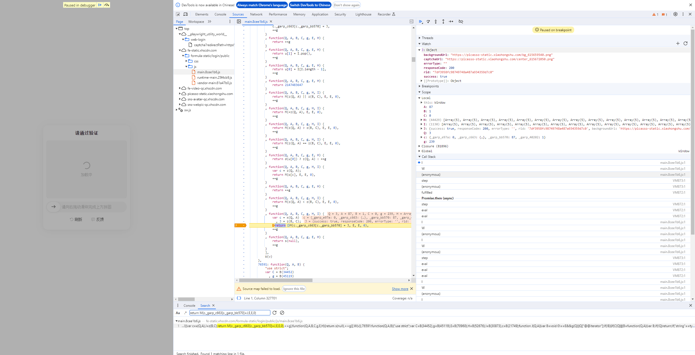
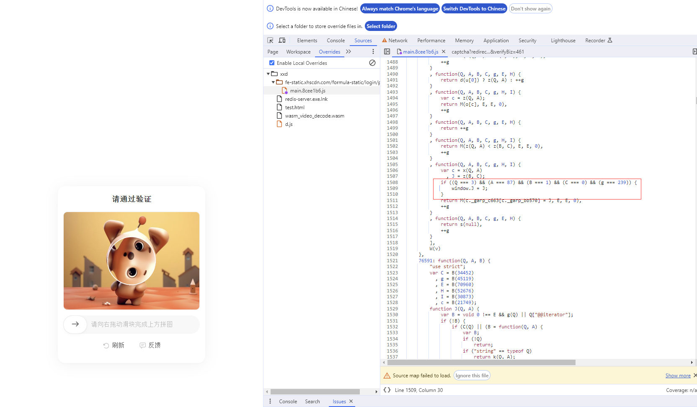
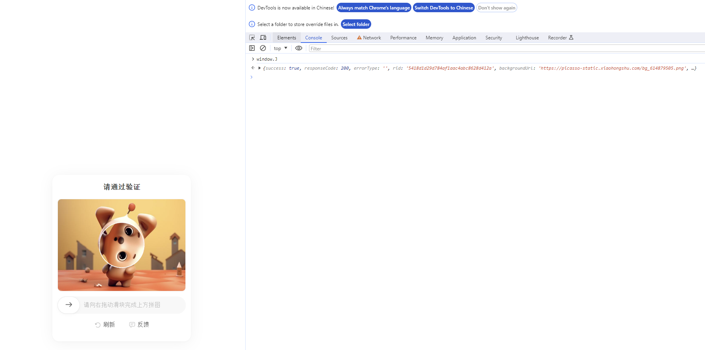

## 小红书验证码破解

### 定位

搜索

```text
return M(c._garp_c663[c._garp_bb570]=J,E,E,0)
```

加入条件断点

```js
typeof (J) == 'object' && J.hasOwnProperty('captchaUrl')
```



3次可以debug到的值，Q A B C g分别如下

| Q | A   | B | C | g   |
|---|-----|---|---|-----|
| 3 | 127 | 1 | 0 | 41  |
| 3 | 172 | 1 | 0 | 584 |
| 3 | 87  | 1 | 0 | 239 |

重写js

